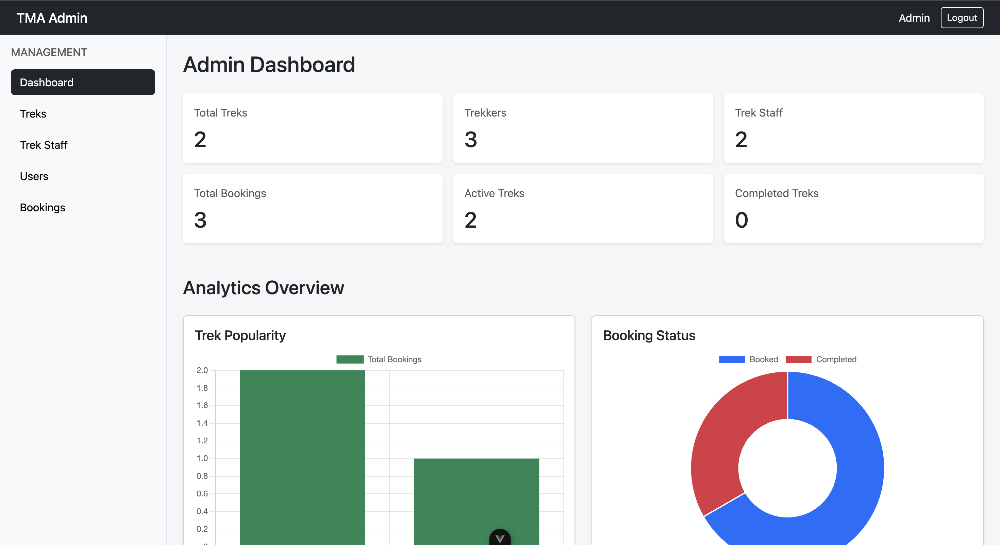
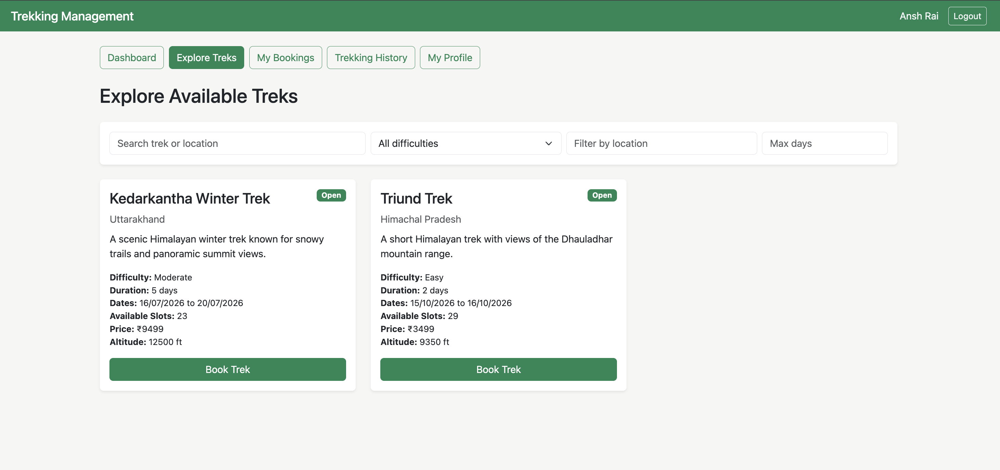
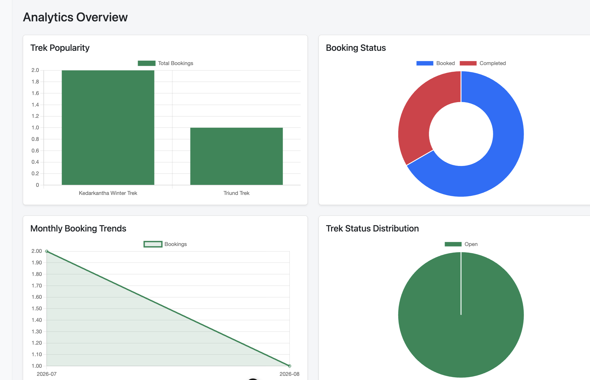

# Trekking Management Application V2

Trekking Management Application V2 (TMA-V2) is a full-stack web application developed as part of the Modern Application Development II course.

The application provides a centralized platform for managing trekking activities involving three types of users: Admin, Trek Staff, and Trekker. Administrators can manage treks, staff members, users, bookings, and analytics, while Trek Staff can manage their assigned treks and participants. Trekkers can explore available treks, make bookings, manage their bookings, and view their trekking history.

---

## Screenshots

### Admin Dashboard

<p align="center">
  
</p>

<table>
  <tr>
    <td>
      
    </td>
    <td>
      
    </td>
  </tr>
</table>

---

## Features

TMA-V2 provides role-based trekking management, booking, analytics, and automated background processing.

### Admin Features

* **Protected Admin Dashboard:** Manage the trekking platform through the admin dashboard.
* **Trek Management:** Create, update, delete, search, and filter treks.
* **Staff Management:** Create and manage Trek Staff accounts.
* **Staff Assignment:** Assign Trek Staff members to specific treks.
* **User Management:** View registered users and manage their account status.
* **Account Controls:** Deactivate or blacklist users and staff members.
* **Booking Management:** View and manage all booking records.
* **Analytics Dashboard:** View trekking and booking statistics using interactive Chart.js visualizations.

### Trek Staff Features

* **Staff Authentication:** Login using an account created by the Admin.
* **Assigned Treks:** View only the treks assigned to the logged-in staff member.
* **Participant Management:** View participants registered for assigned treks.
* **Trek Updates:** Update available slots and trek status.
* **Trek Progress:** Mark assigned treks as started or completed.
* **Access Control:** Staff members can only manage their assigned treks.

### Trekker Features

* **Self Registration:** Create a trekker account.
* **Secure Login:** Login using registered credentials.
* **Trek Discovery:** Browse available and open treks.
* **Search and Filtering:** Filter treks by difficulty, location, and duration.
* **Trek Booking:** Book available treks while preventing duplicate bookings and overbooking.
* **Booking Management:** View booking status and cancel bookings where applicable.
* **Trekking History:** View complete previous and current trekking activity.
* **Profile Management:** Update personal profile information.
* **CSV Export:** Export complete trekking history as a CSV file.

---

## Background Jobs

The application uses Celery with Redis to handle asynchronous and scheduled background tasks.

### Daily Trek Reminders

A scheduled Celery task checks for upcoming treks and sends email reminders to registered participants containing relevant trek information and the scheduled start date.

### Monthly Admin Activity Report

A scheduled background task generates a monthly HTML activity report containing:

* Number of treks conducted.
* Total number of participants.
* Most popular trek.

The generated report is automatically sent to the Admin through email.

### Asynchronous CSV Export

Trekkers can export their complete trekking history as a CSV file.

The export contains:

* User ID
* Trek name
* Location
* Booking status
* Booking date
* Trek start date
* Trek end date

The CSV generation is handled asynchronously by a Celery worker so that the main Flask application is not blocked while the file is being generated.

---

## Redis Caching

Redis is used to improve application performance by caching frequently accessed trek-related data.

The implementation includes:

* Caching of frequently accessed trek listings.
* Cache expiration.
* Cache invalidation when trek information is modified.
* Redis as the Celery message broker.
* Redis as the Celery result backend.

---

## Analytics

The Admin dashboard provides interactive analytics and visualizations using Chart.js.

Available analytics include:

* Trek popularity.
* Booking status distribution.
* Monthly booking trends.
* Trek status distribution.

---

## Technology Stack

| Technology / Library | Purpose |
| :--- | :--- |
| **Flask** | REST API backend framework |
| **Vue.js 3** | Frontend user interface |
| **Vite** | Frontend development and build tool |
| **SQLAlchemy** | Object Relational Mapper for database operations |
| **SQLite** | Relational database |
| **Bootstrap 5** | Responsive frontend styling |
| **Flask-JWT-Extended** | JWT-based authentication and authorization |
| **Axios** | Communication between Vue.js frontend and Flask APIs |
| **Redis** | API caching and Celery message broker |
| **Celery** | Asynchronous background jobs |
| **Celery Beat** | Scheduled background tasks |
| **Flask-Mail** | Email reminders and monthly Admin reports |
| **Flask-Caching** | Redis-based API caching |
| **Chart.js** | Admin analytics and data visualization |
| **Flask-CORS** | Cross-origin communication between frontend and backend |

---

## Database Models

The application uses SQLAlchemy ORM models to represent the main database entities.

### User
Stores authentication and account information for Admin, Trek Staff, and Trekkers.  
The User model also stores role, account status, blacklist status, and timestamps.

### Staff Profile
Stores additional information specific to Trek Staff members, including:

* Experience
* Specialization
* Emergency contact
* Biography
* Staff status

### Trek
Stores trekking event information such as:

* Trek name
* Location
* Difficulty
* Duration
* Altitude
* Available slots
* Price
* Assigned staff
* Trek status
* Start and end dates

### Booking
Stores the relationship between Trekkers and Treks and maintains booking information and booking status.

---

## Authentication and Authorization

The application uses JWT-based authentication with role-based access control.

After successful login, the Flask backend generates a JWT access token. The frontend stores the token in browser Local Storage and sends it with protected API requests using the `Authorization: Bearer <token>` header.

The application supports three roles:
* **Admin**
* **Trek Staff**
* **Trekker**

Role-based decorators restrict access to resources according to the user's role.

---

## API Architecture

The Vue.js frontend communicates with the Flask backend using REST APIs through Axios.

Major API groups include:

* **`/api/auth`** — Authentication and registration.
* **`/api/admin`** — Admin dashboard, analytics, treks, users, staff, and bookings.
* **`/api/staff`** — Staff dashboard, assigned treks, and participant management.
* **`/api/trekker`** — Trek discovery, booking, booking history, profile management, and CSV export.

The general request flow is:

```text
Vue.js Frontend
       ↓
     Axios
       ↓
Flask REST API
       ↓
Role / JWT Validation
       ↓
SQLAlchemy ORM
       ↓
SQLite Database
```

---

## Getting Started

### Prerequisites

* Python 3.x
* Node.js
* npm
* Redis
* A Gmail account with an App Password for email functionality

---

### Installation

1. **Clone the repository:**
   ```bash
   git clone <your-repository-url>
   cd <project-folder>
   ```

2. **Set up the backend environment:**
   ```bash
   cd backend
   python -m venv env
   source env/bin/activate
   ```
   *On Windows:*
   ```bash
   env\Scripts\activate
   ```

3. **Install backend dependencies:**
   ```bash
   pip install -r requirements.txt
   ```

4. **Install frontend dependencies:**
   ```bash
   cd ../frontend
   npm install
   ```

---

### Running the Application

#### 1. Start Redis
```bash
redis-server
```

Verify that Redis is running:
```bash
redis-cli ping
```
*Expected output:*
```text
PONG
```

#### 2. Start the Flask Backend
Navigate to the backend directory:
```bash
cd backend
```

Activate the virtual environment:
```bash
source env/bin/activate
```

Run the Flask application:
```bash
python app.py
```

The backend runs at:
```text
http://127.0.0.1:5001
```

#### 3. Start the Vue.js Frontend
Navigate to the frontend directory:
```bash
cd frontend
```

Start the development server:
```bash
npm run dev
```

The frontend normally runs at:
```text
http://localhost:5173
```

#### 4. Start the Celery Worker
From the `backend` directory with the virtual environment activated:
```bash
celery -A celery_worker.celery worker --loglevel=info
```

#### 5. Start Celery Beat
In another terminal:
```bash
celery -A celery_worker.celery beat --loglevel=info
```

---

## Environment Variables

Create a `.env` file inside the `backend` directory for the email configuration:

```env
MAIL_USERNAME=your-email@gmail.com
MAIL_PASSWORD=your-google-app-password
ADMIN_REPORT_EMAIL=admin-email@example.com
```

> **Note:** Do not commit real email credentials or Google App Passwords to a public repository.

---

## Project Highlights

* Three-role authentication and authorization system.
* JWT-based authentication.
* Role-based access control.
* Complete trek and booking management.
* Staff assignment and participant management.
* Search and filtering functionality.
* Redis API caching.
* Celery asynchronous background tasks.
* Celery Beat scheduled tasks.
* Automated trek reminder emails.
* Monthly Admin activity reports.
* Asynchronous CSV export.
* Interactive Chart.js analytics dashboard.
* Responsive Vue.js and Bootstrap user interface.

---

## Author

**Ansh Rai**